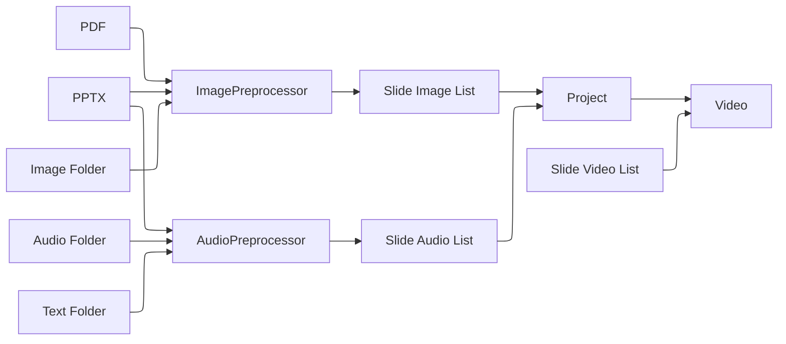

# slides2vid

Convert slides w/ notes to a video presentation using TTS.

```mermaid
 flowchart-elk LR;
    PDF-->ImagePreprocessor;
    PPTX-->ImagePreprocessor;
    IF[Image Folder]-->ImagePreprocessor;
    PPTX-->AudioPreprocessor;
    AF[Audio Folder]-->AudioPreprocessor;
    TF[Text Folder]-->AudioPreprocessor;
    
    ImagePreprocessor-->SIL[Slide Image List];
    AudioPreprocessor-->SAL[Slide Audio List];
    SAL-->Project;
    SIL-->Project;
    SVL[Slide Video List];
    Project-->Video;
    SVL-->Video;
```
